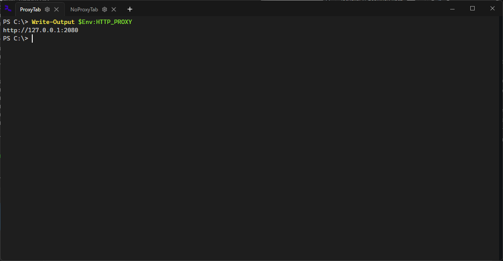
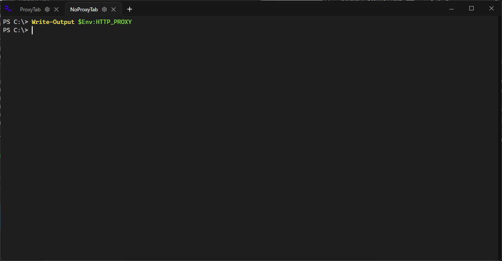

# TerminalStudio

A modern terminal manager for Windows with per-tab proxy support.





## Features

- **Tabs in titlebar** — browser-style tabs integrated directly into the window header, just like VS Code and Windows Terminal. Supports horizontal scrolling, manual tab resizing by dragging, and pinned `+` button.
- **Per-tab proxy** — each tab has its own independent network configuration: Direct, Local VPN or Custom Proxy with `NO_PROXY` exceptions and built-in connectivity check.
- **Session restore** — all open tabs, their titles, working directories and proxy settings are automatically saved on close and fully restored on next launch.
- **Native terminal rendering** — powered by Windows ConPTY and [xterm.js](https://xtermjs.org/) inside a single WebView2 instance for minimal memory footprint.
- Supports **PowerShell**, **CMD** and **WSL**.

## Requirements

- Windows 10 / 11 (x64)
- [.NET 10 Runtime](https://dotnet.microsoft.com/download/dotnet/10.0)
- [WebView2 Runtime](https://developer.microsoft.com/microsoft-edge/webview2/) (pre-installed on Windows 11)
- 100 MB RAM (no tabs open)

## Installation

### Download (recommended)

Grab the latest from [GitHub Releases](https://github.com/Mixxtec/TerminalStudio/releases).

### Build from source

```bash
git clone https://github.com/Mixxtec/TerminalStudio.git
cd TerminalStudio/TerminalStudio
dotnet build
```

Run the output from `bin/Debug/net10.0-windows/TerminalStudio.exe`.

## Architecture

| Component | Solution |
|---|---|
| Language | C# / WPF (.NET 10) |
| Terminal engine | Windows ConPTY |
| Terminal renderer | xterm.js inside a **single** WebView2 |
| Session storage | JSON (`%AppData%\TerminalStudio\session.json`) |
| Proxy | Per-process environment variables (`HTTP_PROXY`, `HTTPS_PROXY`, `NO_PROXY`) |

**Why a single WebView2?**
WebView2 uses ~80–100 MB on its own — spinning up one instance per tab would be prohibitively expensive. Instead, all tabs share one WebView2 page with independent xterm.js instances that are shown or hidden via CSS. Each instance has its own scroll buffer, history and state, and ConPTY processes run in the background continuously regardless of which tab is visible. Tab switching is instant.

## Roadmap

- **v1.1** — System tray integration, complete rework of the new tab menu (PowerShell, pwsh, CMD, WSL distros, custom `.exe` from `PATH`), tab drag-and-drop reordering.
- **v1.2** — Auto-start script chains, shared and per-tab command history navigation (`Alt+Up` / `Alt+Down`).
- **v1.3** — Split container layouts (horizontal and vertical panes within a single tab).
- **Future** — Multi-window support and tab tear-off.

## License

[MIT](./LICENSE) © 2026 Mixxtec

## Third-Party Licenses

 - [xterm.js](https://github.com/xtermjs/xterm.js) — MIT License (c) Microsoft Corporation
 - [xterm-addon-fit](https://github.com/xtermjs/xterm.js) — MIT License (c) Microsoft Corporation
 - [WebView2](https://developer.microsoft.com/en-us/microsoft-edge/webview2/) — (c) Microsoft Corporation